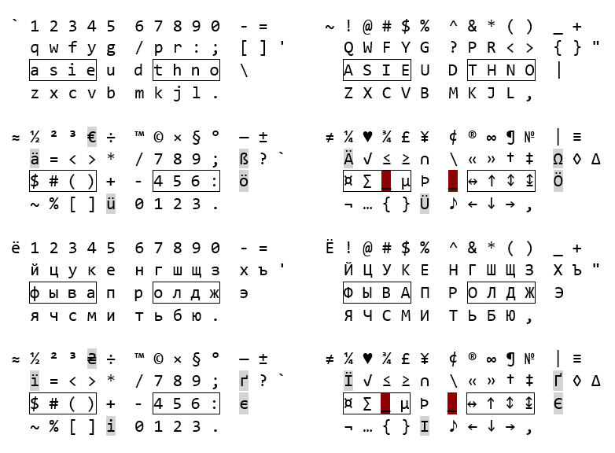

# Keyboard2022
My own Latin and Cyrillic layouts, as of beginning of year 2022.

[LAT2022A.klc](LAT2022A.klc) and [CYR2022A.klc](CYR2022A.klc) - description of the layouts. Edit them in [Microsoft Keyboard Layout Creator 1.4](https://www.microsoft.com/en-us/download/details.aspx?id=102134). Then verify and make setup.

[setup_lat2022a.zip](setup_lat2022a.zip) and [setup_cyr2022a.zip](setup_cyr2022a.zip) - unzip and run setup.exe (or particular msi if you wish) to install the new layout.

